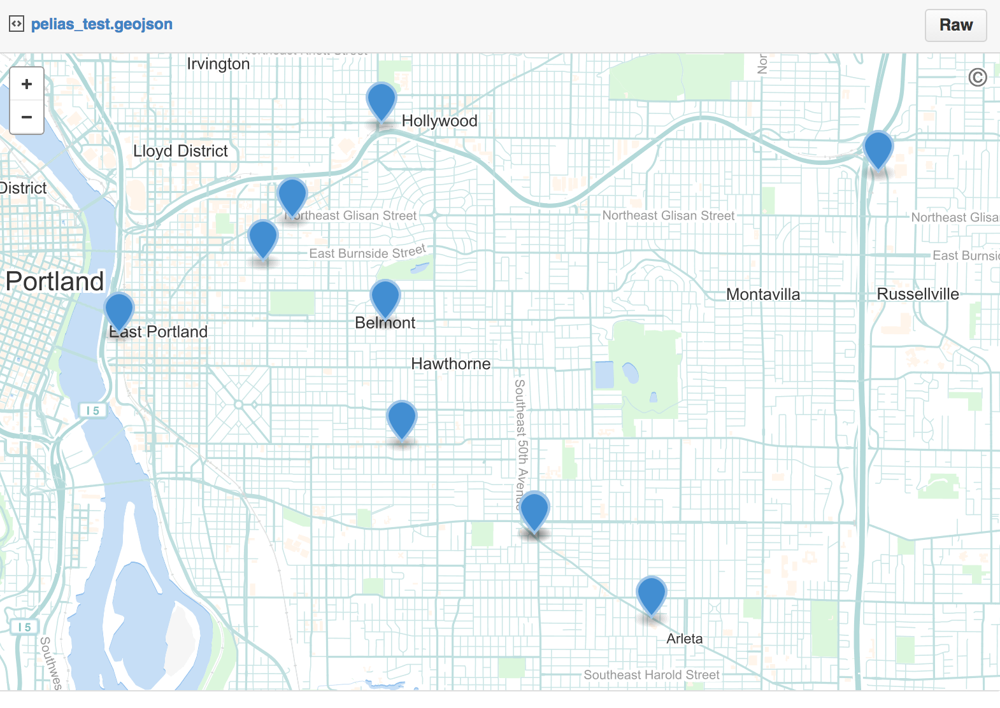

gistr
=======


[](https://travis-ci.org/ropensci/gistr)
[](https://ci.appveyor.com/project/sckott/gistr/branch/master)

`gistr` is a light interface to GitHub's gists for R.

## See also:

* [rgithub](https://github.com/cscheid/rgithub) an R client for the Github API by Carlos Scheidegger
* [git2r](https://github.com/ropensci/git2r) an R client for the libgit2 C library by Stefan Widgren

## Quick start

### Install


```r
devtools::install_github("ropensci/gistr")
```


```r
library("gistr")
```

### Authentication

There are two ways to authorise gistr to work with your GitHub account:

* Generate a personal access token (PAT) at [https://help.github.com/articles/creating-an-access-token-for-command-line-use](https://help.github.com/articles/creating-an-access-token-for-command-line-use) and record it in the `GITHUB_PAT` envar.
* Interactively login into your GitHub account and authorise with OAuth.

Using the PAT is recommended.

Using the `gist_auth()` function you can authenticate seperately first, or if you're not authenticated, this function will run internally with each functionn call. If you have a PAT, that will be used, if not, OAuth will be used.


```r
gist_auth()
```

### Workflow

In `gistr` you can use pipes, introduced perhaps first in R in the package `magrittr`, to pass outputs from one function to another. If you have used `dplyr` with pipes you can see the difference, and perhaps the utility, of this workflow over the traditional workflow in R. You can use a non-piping or a piping workflow with `gistr`. Examples below use a mix of both workflows. Here is an example of a piping wofklow (with some explanation):


```r
gists(what = "minepublic")[[1]] %>% # List my public gists, and index to get just the 1st one
  add_files("~/alm_othersources.md") %>% # Add a new file to that gist
  update() # update sends a PATCH command to the Gists API to add the file to your gist online
```

And a non-piping workflow that does the same exact thing:


```r
g <- gists(what = "minepublic")[[1]]
g <- add_files(g, "~/alm_othersources.md")
update(g)
```

Or you could string them all together in one line (but it's rather difficult to follow what's going on because you have to read from the inside out)


```r
update(add_files(gists(what = "minepublic")[[1]], "~/alm_othersources.md"))
```

### Rate limit information


```r
rate_limit()
#> Rate limit: 5000
#> Remaining:  5000
#> Resets in:  60 minutes
```


### List gists

Limiting to a few results here to keep it brief


```r
gists(per_page = 2)
#> [[1]]
#> <gist>9b626473dc4a41005427
#>   URL: https://gist.github.com/9b626473dc4a41005427
#>   Description: 
#>   Public: TRUE
#>   Created/Edited: 2015-01-26T18:15:12Z / 2015-01-26T18:15:13Z
#>   Files: html5
#> 
#> [[2]]
#> <gist>7a3b3bbfa721a3b35398
#>   URL: https://gist.github.com/7a3b3bbfa721a3b35398
#>   Description: test
#>   Public: TRUE
#>   Created/Edited: 2015-01-26T18:15:03Z / 2015-01-26T18:15:03Z
#>   Files: config.json, inlet.js, us500.csv
```

Since a certain date/time


```r
gists(since='2014-05-26T00:00:00Z', per_page = 2)
#> [[1]]
#> <gist>9b626473dc4a41005427
#>   URL: https://gist.github.com/9b626473dc4a41005427
#>   Description: 
#>   Public: TRUE
#>   Created/Edited: 2015-01-26T18:15:12Z / 2015-01-26T18:15:13Z
#>   Files: html5
#> 
#> [[2]]
#> <gist>7a3b3bbfa721a3b35398
#>   URL: https://gist.github.com/7a3b3bbfa721a3b35398
#>   Description: test
#>   Public: TRUE
#>   Created/Edited: 2015-01-26T18:15:03Z / 2015-01-26T18:15:03Z
#>   Files: config.json, inlet.js, us500.csv
```

Request different types of gists, one of public, minepublic, mineall, or starred.


```r
gists('minepublic', per_page = 2)
#> [[1]]
#> <gist>431989eb78b73184697c
#>   URL: https://gist.github.com/431989eb78b73184697c
#>   Description: gist gist gist
#>   Public: TRUE
#>   Created/Edited: 2015-01-26T11:51:48Z / 2015-01-26T11:51:48Z
#>   Files: stuff.md
#> 
#> [[2]]
#> <gist>b03f8efa868ac3271a41
#>   URL: https://gist.github.com/b03f8efa868ac3271a41
#>   Description: gist gist gist
#>   Public: TRUE
#>   Created/Edited: 2015-01-25T11:50:29Z / 2015-01-25T11:50:29Z
#>   Files: stuff.md
```


### List a single commit


```r
gist(id = 'f1403260eb92f5dfa7e1')
#> <gist>f1403260eb92f5dfa7e1
#>   URL: https://gist.github.com/f1403260eb92f5dfa7e1
#>   Description: Querying bitly from R 
#>   Public: TRUE
#>   Created/Edited: 2014-10-15T20:40:12Z / 2014-10-15T21:54:29Z
#>   Files: bitly_r.md
```

### Create gist

You can pass in files


```r
gist_create(files="~/stuff.md", description='a new cool gist')
```


```r
gist_create(files="~/stuff.md", description='a new cool gist', browse = FALSE)
#> <gist>00759084c3af09d6c54f
#>   URL: https://gist.github.com/00759084c3af09d6c54f
#>   Description: a new cool gist
#>   Public: TRUE
#>   Created/Edited: 2015-01-26T18:15:23Z / 2015-01-26T18:15:23Z
#>   Files: stuff.md
```

Or, wrap `gist_create()` around some code in your R session/IDE, like so, with just the function name, and a `{'` at the start and a `}'` at the end.


```r
gist_create(code={'
x <- letters
numbers <- runif(8)
numbers

[1] 0.3229318 0.5933054 0.7778408 0.3898947 0.1309717 0.7501378 0.3206379 0.3379005
'})
```


```r
gist_create(code={'
x <- letters
numbers <- runif(8)
numbers

[1] 0.3229318 0.5933054 0.7778408 0.3898947 0.1309717 0.7501378 0.3206379 0.3379005
'}, browse=FALSE)
#> <gist>2f86521142c605fd4740
#>   URL: https://gist.github.com/2f86521142c605fd4740
#>   Description: 
#>   Public: TRUE
#>   Created/Edited: 2015-01-26T18:15:23Z / 2015-01-26T18:15:23Z
#>   Files: code.R
```

#### knit and create

You can also knit an input file before posting as a gist:


```r
file <- system.file("examples", "stuff.Rmd", package = "gistr")
gist_create(file, description='a new cool gist', knit=TRUE)
#> <gist>4162b9c53479fbc298db
#>   URL: https://gist.github.com/4162b9c53479fbc298db
#>   Description: a new cool gist
#>   Public: TRUE
#>   Created/Edited: 2014-10-27T16:07:31Z / 2014-10-27T16:07:31Z
#>   Files: stuff.md
```

Or code blocks before (note that code blocks without knitr block demarcations will result in unexecuted code):


```r
gist_create(code={'
x <- letters
(numbers <- runif(8))
'}, knit=TRUE)
#> <gist>ec45c396dee4aa492139
#>   URL: https://gist.github.com/ec45c396dee4aa492139
#>   Description:
#>   Public: TRUE
#>   Created/Edited: 2014-10-27T16:09:09Z / 2014-10-27T16:09:09Z
#>   Files: file81720d1ceff.md
```

### knit code from file path, code block, or gist file

knit a local file


```r
file <- system.file("examples", "stuff.Rmd", package = "gistr")
run(file, knitopts = list(quiet=TRUE)) %>% gist_create(browse = FALSE)
#> <gist>d3352b5062c442199483
#>   URL: https://gist.github.com/d3352b5062c442199483
#>   Description: 
#>   Public: TRUE
#>   Created/Edited: 2015-01-26T18:15:24Z / 2015-01-26T18:15:24Z
#>   Files: stuff.md
```


knit a code block (knitr code block notation missing, do add that in) (result not shown)


```r
run({'
x <- letters
(numbers <- runif(8))
'}) %>% gist_create
```

knit a file from a gist, has to get file first (result not shown)


```r
gists('minepublic')[[1]] %>% run() %>% update()
```

### List commits on a gist


```r
gists()[[1]] %>% commits()
#> [[1]]
#> <commit>
#>   Version: d2743f0c6b150b90e9f91ffcb2b9c96be5989d5b
#>   User: sckott
#>   Commited: 2015-01-26T18:15:23Z
#>   Commits [total, additions, deletions]: [5,5,0]
```

### Star a gist

Star


```r
gist('7ddb9810fc99c84c65ec') %>% star()
#> <gist>7ddb9810fc99c84c65ec
#>   URL: https://gist.github.com/7ddb9810fc99c84c65ec
#>   Description: 
#>   Public: TRUE
#>   Created/Edited: 2014-06-27T17:50:37Z / 2014-06-27T17:50:37Z
#>   Files: code.R, manifest.yml, rrt_manifest.yml
```

Unstar


```r
gist('7ddb9810fc99c84c65ec') %>% unstar()
#> <gist>7ddb9810fc99c84c65ec
#>   URL: https://gist.github.com/7ddb9810fc99c84c65ec
#>   Description: 
#>   Public: TRUE
#>   Created/Edited: 2014-06-27T17:50:37Z / 2014-06-27T17:50:37Z
#>   Files: code.R, manifest.yml, rrt_manifest.yml
```

### Edit a gist

Add files


```r
gists(what = "minepublic")[[1]] %>%
  add_files("~/alm_othersources.md") %>%
  update()
#> <gist>2f86521142c605fd4740
#>   URL: https://gist.github.com/2f86521142c605fd4740
#>   Description: 
#>   Public: TRUE
#>   Created/Edited: 2015-01-26T18:15:23Z / 2015-01-26T18:15:26Z
#>   Files: alm_othersources.md, code.R
```

Delete files


```r
gists(what = "minepublic")[[1]] %>%
  delete_files("~/alm_othersources.md") %>%
  update()
#> <gist>2f86521142c605fd4740
#>   URL: https://gist.github.com/2f86521142c605fd4740
#>   Description: 
#>   Public: TRUE
#>   Created/Edited: 2015-01-26T18:15:23Z / 2015-01-26T18:15:27Z
#>   Files: code.R
```

### Open a gist in your default browser


```r
gists()[[1]] %>% browse()
```

> Opens the gist in your default browser

### Get embed script


```r
gists()[[1]] %>% embed()
#> [1] "<script src=\"https://gist.github.com//2d8bdd257cc9abb4e7b6.js\"></script>"
```

### List forks

Returns a list of `gist` objects, just like `gists()`


```r
gist(id='1642874') %>% forks(per_page=2)
#> [[1]]
#> <gist>1642989
#>   URL: https://gist.github.com/1642989
#>   Description: Spline Transition
#>   Public: TRUE
#>   Created/Edited: 2012-01-19T21:45:20Z / 2014-12-10T03:25:19Z
#>   Files: 
#> 
#> [[2]]
#> <gist>1643051
#>   URL: https://gist.github.com/1643051
#>   Description: Line Transition (Broken)
#>   Public: TRUE
#>   Created/Edited: 2012-01-19T21:51:30Z / 2015-01-15T16:50:51Z
#>   Files:
```

### Fork a gist

Returns a `gist` object


```r
g <- gists()
(forked <- g[[ sample(seq_along(g), 1) ]] %>% fork())
#> <gist>33678ebfc3fc2721eab7
#>   URL: https://gist.github.com/33678ebfc3fc2721eab7
#>   Description: Bootstrap Customizer Config
#>   Public: TRUE
#>   Created/Edited: 2015-01-26T18:15:29Z / 2015-01-26T18:15:29Z
#>   Files: config.json
```


## Example use case

_Working with the Mapzen Pelias geocoding API_

The API is described at https://github.com/pelias/pelias, and is still in alpha they say. The steps: get data, make a gist. The data is returned from Mapzen as geojson, so all we have to do is literally push it up to GitHub gists and we're done b/c GitHub renders the map.


```r
library('httr')
base <- "http://pelias.mapzen.com/search"
res <- GET(base, query = list(input = 'coffee shop', lat = 45.5, lon = -122.6))
json <- content(res, as = "text")
gist_create(code = json, filename = "pelias_test.geojson")
#> <gist>017214637bcfeb198070
#>   URL: https://gist.github.com/017214637bcfeb198070
#>   Description:
#>   Public: TRUE
#>   Created/Edited: 2014-10-28T14:42:36Z / 2014-10-28T14:42:36Z
#>   Files: pelias_test.geojson
```

And here's that [gist](https://gist.github.com/sckott/017214637bcfeb198070)



## Meta

* Please [report any issues or bugs](https://github.com/ropensci/gistr/issues).
* License: MIT
* Get citation information for `gistr` in R doing `citation(package = 'gistr')`

[](http://ropensci.org)
